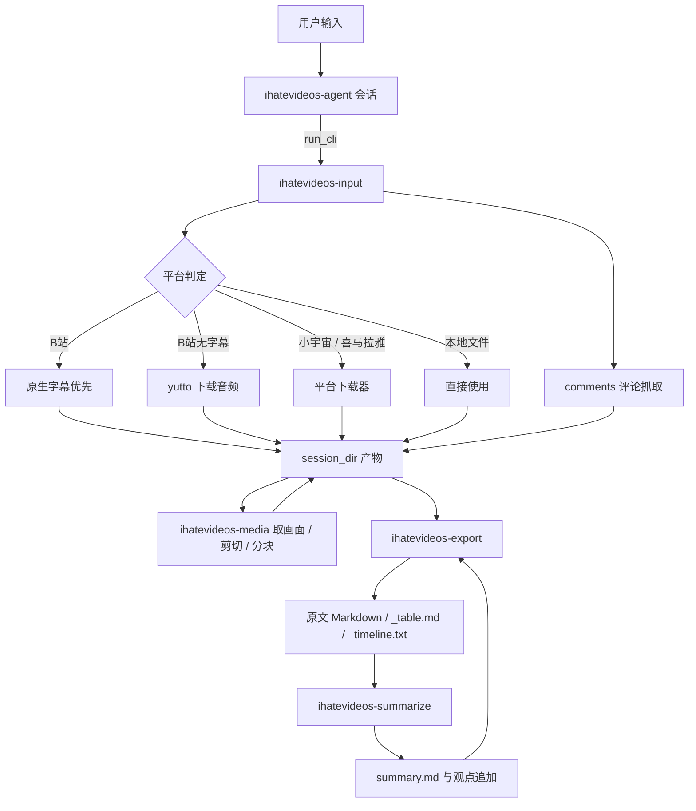

# iHateVideos 工程分析

分析对象：`f:\Codes\iHateVideos\iHateVideos`，分支 `main`，提交 `f2934653a763af1704c19c5bc387d1b524b042a2`。
分析方式：只读。阅读全部源码、配置、Skills 文档，并运行轻量离线命令确认工程可运行。

## 工程用途

一个 Python 命令行工具集合，把视频与播客内容变成可检索、可复制的文字与总结。整条链路分为输入接入、媒体处理、转录文本整理、LLM 总结、内容导出、有监督 Agent 六个部分。

版本 0.3.0（`VERSION`、`pyproject.toml`、`CHANGELOG.md` 三处一致），使用 uv 管理依赖，要求 Python 3.11 以上。

工程内没有语音识别实现：`ihatevideos-export` 的 `json2md` 接受外部已经产出的转录 JSON（兼容 Qwen、Groq、火山三种结构），`docs/cloud-stt.md` 是云端语音识别的选型调研与适配器设想，没有对应代码。转录音频这一步当前由工程之外的流程完成，B 站原生字幕命中时可以直接跳过这一步。

## 六个命令行入口

`pyproject.toml` 声明：

| 命令 | 代码位置 | 作用 |
|---|---|---|
| `ihatevideos` | `src/ihatevideos/__init__.py` | 占位入口，只打印一行问候语 |
| `ihatevideos-input` | `src/ihatevideos/input/cli.py` | 多平台输入接入、登录态、字幕、评论 |
| `ihatevideos-export` | `src/ihatevideos/export/cli.py` | 转录 JSON 转 Markdown、总结表格、B 站时间线 |
| `ihatevideos-media` | `src/ihatevideos/media/cli.py` | ffprobe 读信息、取画面、剪切、提取音轨与分块 |
| `ihatevideos-summarize` | `src/ihatevideos/summarize/cli.py` | 转录转总结、评论观点追加 |
| `ihatevideos-agent` | `src/ihatevideos/agent/cli.py` | 有监督 Agent：登录预检、跑 CLI、写文件审批 |

## 目录构成

- `src/ihatevideos/input/`：13 个源文件。`platform.py` 放平台枚举、`PlatformMetadata`、下载器接口与文件名处理；`url_detect.py` 做平台判定与 ID 提取；`resolver.py` 是统一入口；`bilibili_audio.py` 通过 yutto 的 Python 接口下载音频；`subtitle.py` 调用 `bili` 命令行取原生字幕；`comments.py` 走 B 站 WBI 接口取评论并在失败时改用旧接口；`cookies.py` 从 Netscape 格式 cookies.txt 导入 SESSDATA；`metadata.py` 取视频元数据；`xiaoyuzhou.py` 与 `ximalaya.py` 是两个平台的下载器；`artifacts.py` 负责会话目录与产物文件名；`bilibili_categories.py` 是分区编号对照表。
- `src/ihatevideos/export/`：5 个源文件。`json_to_md.py` 兼容 Qwen、Groq、火山三类转录 JSON；`tables.py` 提取 Markdown 表格块；`timeline.py` 从表格里的 `视频时间` 列解析时间点；`markdown_fmt.py` 在装有 `markdownlint-cli2` 时格式化。
- `src/ihatevideos/summarize/`：4 个源文件。`presets.py` 内置四个提示词预设（金融主题 `timeline_merge`、通用总结 `summary`、学习笔记 `study_notes`、投资播客 `investment_podcast`）；`client.py` 用 langchain-openai 的 `ChatOpenAI` 调模型；`summarize.py` 负责提示词拼装、标题推断与观点追加的后处理。
- `src/ihatevideos/media/`：8 个源文件。`ffmpeg.py` 统一解析 `ffmpeg`/`ffprobe` 位置与执行；`paths.py` 用参数摘要（sha1 前 8 位）区分不同参数的产物；`timestamps.py` 解析 `90`、`1:30`、`1:02:03.250` 三种写法；`probe.py`、`frames.py`、`clip.py`、`audio.py` 是四个功能实现。
- `src/ihatevideos/agent/`：5 个源文件。`config.py` 读取根目录 `config.toml`；`tools.py` 定义三个工具与命令白名单；`harness.py` 用 LangChain `create_agent` 组装 Agent，并对 `write_file` 挂审批中间件；`runner.py` 负责登录预检、审批交互与最终 JSON 输出。
- `skills/`：五个随仓库提交的工程 Skill，每个带 `SKILL.md`，四个带 `evals/evals.json`。
- `.agents/skills/`：两个本地通用工具 Skill（`find-skills`、`git-small-project-workflow`），不进仓库。
- `docs/cloud-stt.md`：云端语音识别服务调研，覆盖国内五家与海外四家的上传方式、时长限制、认证方式，末尾给出适配器设想。
- `temp/`：中间产物与会话目录，不进仓库。当前存在三个会话目录、`temp/media/` 下的实测产物、一个 cookies.txt。

## 数据流

## 会话目录与文件命名约定

`input/artifacts.py` 的 `prepare_session_dir` 创建 `temp/<发布日期>-<标题前50字>-<BV号>/`，目录已存在时追加 `_2`、`_3` 序号，不覆盖旧产物。日期取视频发布时间，取不到用当天。

| 产物 | 文件名 | 产出位置 |
|---|---|---|
| 字幕纯文本 | `<BV号>_sub.txt` | 会话目录 |
| 字幕时间轴 | `<BV号>_sub_items.json` | 会话目录 |
| 视频元数据 | `<BV号>_meta.json` | 会话目录 |
| 评论数据与 Markdown | `<BV号>_comments.json`、`<BV号>_comments.md` | 会话目录 |
| 转录原文 | `<主干名>.md` | 转录 JSON 同目录 |
| 总结 | `<主干名>_summary.md` | 转录同目录 |
| 干净表格 | `<主干名>_table.md` | 总结同目录 |
| B 站时间线 | `<主干名>_timeline.txt` | 总结同目录 |
| 画面图片 | `frames/frame-<序号>_<秒数>s_<参数摘要>.jpg` | `temp/media/<主干名>/` |
| 音轨 | `audio/<主干名>_<参数摘要>.wav` | 同上 |
| 音轨分块 | `audio/chunks-<时长>-<参数摘要>/audio-<序号>.wav` | 同上 |
| 剪切片段 | `clips/<主干名>_<起>-<止>_<参数摘要>.mp4` | 同上 |

## 退出码约定

`input` 与 `export` 使用同一套：`0` 成功，`2` 输入不合法，`1` 运行失败，`3` 表示正常跳过（无原生字幕、无表格、无可用时间点）。`media` 额外用 `3` 表示缺少需要的流。这套约定写在 `export/cli.py` 的模块说明与各个 `SKILL.md` 里，是 Agent 判断是否继续的依据。

## Agent 的运行方式

`agent/tools.py` 的 `ALLOWED_COMMANDS` 限定三个命令及其子命令：

| 命令 | 允许的子命令 |
|---|---|
| `ihatevideos-input` | `detect`、`normalize`、`ids`、`ximalaya`、`resolve`、`cookies`、`subtitle`、`comments` |
| `ihatevideos-export` | `json2md`、`table`、`timeline` |
| `ihatevideos-media` | `probe`、`frames`、`clip`、`audio` |

白名单与三个模块的实际子命令完全对应。`run_cli` 以 `uv run <命令>` 形式在工程根目录执行，输出上限 20000 字符。`read_file` 可读工程内外的文本文件，遇到二进制内容会拒绝。`write_file` 只允许写 `temp/` 以内的路径。

`runner.py` 的会话流程：先读根目录 `config.toml`，缺失时退出码 2；任务文本里出现 B 站关键字时做登录态预检，状态非 `ok` 就进入三步导入引导，最多三轮，用户输入 `q` 退出；随后进入模型循环，出现中断时用 `ask_approval` 逐条询问 `y/n`，`y` 批准，其他输入按拒绝处理并把提示交给模型；结束时打印含 `session_dir`、`artifacts`、`status`、`note` 的 JSON。

## 模型配置

`config.example.toml` 给出 `[model]` 的 `api_base`、`api_key`、`model` 三个字段，接口按 OpenAI 兼容方式调用。`agent/config.py` 的 `resolve_paths` 把配置文件定在工程根目录的 `config.toml`，`summarize` 模块通过 `agent.config` 复用同一份配置，两个模块共用一套模型设置。

## Skills 体系

`skills/ihatevideos-input/SKILL.md`、`ihatevideos-export/SKILL.md`、`ihatevideos-agent/SKILL.md` 用英文书写，`ihatevideos-media/SKILL.md`、`ihatevideos-summarize/SKILL.md` 用中文书写。每个 Skill 都写明适用场景、模块位置、命令清单、Agent 判断表、回给上层的数据结构，以及三到四条测试提示词。四个 Skill 带 `evals.json`，字段为 `skill_name`、`evals`（`id`、`prompt`、`files`、`expected_output`）。`ihatevideos-media` 没有 `evals.json`。

## 本次验证记录

全部命令在工程根目录执行，未联网，未修改仓库内代码。

| 命令 | 结果 |
|---|---|
| `uv lock --check` | 通过，解析 89 个包 |
| `uv run --no-sync python -c "import ihatevideos.input, ..."` | 六个包全部导入成功 |
| `uv run --no-sync python -m compileall -q src` | 退出码 0 |
| `uv run --no-sync ihatevideos-input detect "BV1xx411c7mD"` | 输出 `platform: bilibili` |
| `uv run --no-sync ihatevideos-input ids "https://www.bilibili.com/video/BV1Kxeb6mE8o?p=2"` | `target_id` 为 `BV1Kxeb6mE8o_p2`，`normalized` 保留 `?p=2` |
| `uv run --no-sync ihatevideos-input cookies --check` | `state: ok`，凭据文件 5.5 天前导入 |
| `uv run --no-sync ihatevideos-media probe "temp/media/470：1RV1126FFMPEG多路码流监控项目大体讲解.mp4"` | 输出 789.146 秒、4K 分辨率 20fps、aac 音轨 |
| `uv run --no-sync ihatevideos-summarize presets` | 四个预设全部列出 |
| `uv run --no-sync ruff check src` | 2 处未使用导入 |

本机环境：`ffmpeg` 与 `ffprobe` 位于 `F:\Softwares\ffmpeg-master-latest-win64-gpl\bin`，在 PATH 中可用；`markdownlint-cli2` 未安装，表格格式化步骤会被跳过；`.venv/Scripts/bili.exe` 存在，版本 0.6.2。

依赖实际版本：bilibili-cli 0.6.2、langchain 1.4.2、langchain-openai 1.6.2、langgraph 1.2.11、yutto 2.1.1、httpx 0.28.1、requests 2.34.2。

## 当前本地状态

- `AGENTS.md` 有一处未提交修改：标题从 `AGENTS.md — SLMaster 工作约定（每会话必读）` 改成 `AGENTS.md — 工作约定（每会话必读）`。
- 工程根目录没有 `config.toml`。`ihatevideos-agent` 与 `ihatevideos-summarize` 当前无法运行，需要按 `config.example.toml` 填写后放到根目录。
- `TODO.md` 有两项待办：YouTube 字幕接入（验收要求 `ytsub` 命令产出会话目录双文件、无字幕返回退出码 3）、语言优先级确认（中简、中繁、英的选用顺序）。
- `temp/` 下有三个历史会话目录与 `temp/media/` 的实测产物，说明输入与媒体两条链路都实际跑过。
- 工程内没有测试目录，验证依靠手工运行命令与各 Skill 的 `evals.json`。

