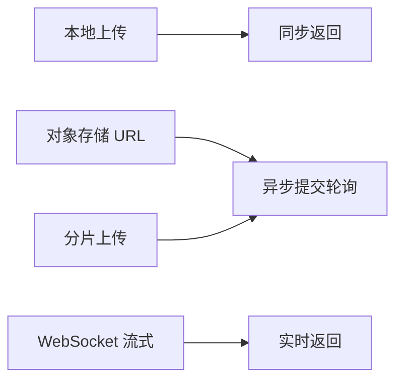

# 云端语音解析调研

使用 agent-reach 的 Exa 搜索后端以及 Jina 网页后端完成本次调研。

## 范围

- 中国大陆：阿里 `DashScope`，腾讯云，百度智能云，火山引擎，讯飞开放平台。
- 非中国大陆：`OpenAI`，`Azure Speech`，`Google Cloud Speech-to-Text`，`AWS Transcribe`。
- 重点为上传方式，分片要求，流式以及批量差异，时长以及文件限制，认证以及地域约束。

## 中国大陆供应商

- 阿里 `DashScope` `Paraformer-v2` 文件转写
  - 接入方式：异步提交轮询，`asyncCall` 之后 `wait` 或者 `fetch`，任务状态 `PENDING`，`RUNNING`，`SUCCEEDED`，`FAILED`。
  - 限制：公网 `HTTP`/`HTTPS` `URL`，不支持 `base64`，不支持二进制流，不支持本地直传，文件 2GB，时长 12 小时，当前 `SDK` 每个请求单个 `URL`，结果 24 小时有效，队列通常数分钟，处理速度为实时数百倍。
  - 特性：`language_hints` 包含 `zh`，`en`，`ja`，`yue`，`ko`，`de`，`fr`，`ru`，说话人区分仅支持单声道，超过 2 小时不建议开启，多音轨按轨计费，内置敏感词过滤，支持时间戳一致开关。
  - 实时版：本地路径阻塞调用，或者 `send_audio_frame` 双向流式，建议每个包 100ms，1KB 至 16KB，`v2` 以上支持长连接心跳，格式包含 `pcm`，`wav`，`mp3`，`opus`，`speex`，`aac`，`amr`。
- 阿里 `Qwen3-ASR-Flash` 系列
  - 短音频同步版：时长 5 分钟，文件 10MB，支持公网 `URL`，`base64`，`SDK` 本地路径，支持流式返回，兼容 `OpenAI` 调用。
  - 长音频异步版 `Qwen3-ASR-Flash-Filetrans`：仅支持公网 `URL`，文件 2GB，时长 12 小时，提交轮询，结果 24 小时有效。
  - 地域：北京 `dashscope.aliyuncs.com`，国际新加坡 `dashscope-intl.aliyuncs.com`，北京工作空间域名性能更优。
  - 对象存储：`OSS` 公网 `URL` 稳定可用，`oss://` 临时地址 48 小时有效，不建议生产使用，上传凭证接口 100 `QPS`，任务查询默认 20 `QPS`，轮询间隔 2 至 5 秒。
  - 认证：`API Key` 配置为环境变量，临时令牌 60 秒有效。
- 腾讯云 `ASR` 录音文件 `CreateRecTask`
  - 接入方式：异步回调，不实时返回，1 小时音频通常 1 至 3 分钟完成，最长 3 小时。
  - 限制：单个 `URL` 时长 5 小时，文件 1GB，本地文件 5MB，默认 20 请求每秒，建议 `COS` 公网可读存储加速处理。
  - 实时版：音频流每个包 200ms，需要开通服务以及 `AppId`。
- 百度智能云
  - 短语音：时长 60 秒，`base64` 或者 `RAW` 提交，`pcm`，`wav`，`amr`，`m4a`，采样率 16000 或者 8000，单声道，超长返回 3308 至 3316 错误。
  - 音频文件转写：`speech_url` 需要 `BOS` 公网地址，文件 500MB，`pid` 区分场景，80001 普通话，80006 字幕，8953 说话人区分，异步返回，一般 12 小时内完成。
- 火山引擎豆包 `Seed ASR`
  - 文件异步：提交轮询，极速同步版时长 2 小时，文件 100MB，无需轮询，标准异步版时长 5 小时，文件 512MB，格式包含 `wav`，`mp3`，`mp4`，`m4a`，`ogg`，`flac`。
  - 流式 `WebSocket`：`bigmodel` 每个包返回，首字延迟较低，`bigmodel_async` 变化才返回，`RTF` 以及首尾延迟更优，`bigmodel_nostream` 超过 15 秒或者尾包返回，准确率较高，建议每个包 100ms 至 200ms，双向流式建议 200ms，自定二进制帧，默认 `gzip`，`Resource-Id` 区分计费，文件识别以及流式识别为独立服务，需要分别开通。
  - 特性：`ITN`，标点，口语规整，话语时间戳。
- 讯飞开放平台
  - 录音文件转写：时长 5 小时，文件 500MB，格式覆盖 `mp3`，`wav`，`pcm`，`aac`，`opus`，`flac`，`ogg`，`m4a`，`amr`，`speex`，采样率 16k 或者 8k，预处理之后分片上传，建议分片 10MB，合并之后创建任务，轮询获取结果，获取次数不超 100 次，结果保留按产品为 30 天，7 天，72 小时，1 小时音频分钟级返回，`SLA` 最长 5 小时，默认每秒不超 20 次。
  - 极速版：小文件 30MB 直传，大文件分块初始化上传完成，`wav`，`pcm`，`mp3`，16k 单声道，1 小时音频 1 分钟左右完成，最短 20 秒左右，方言种类较多。

## 非中国大陆供应商

- `OpenAI` `/audio/transcriptions`
  - 接入方式：`multipart` 直传文件，同步返回，或者 `stream=true` 以 `SSE` 返回增量文本。
  - 限制：文件 25MB，格式 `mp3`，`mp4`，`mpeg`，`mpga`，`m4a`，`wav`，`webm`，另含 `flac`，`ogg`，超过 25MB 需要压缩或者切分 25MB 以下，切分需要避开句子中间。
  - 模型：`gpt-transcribe` 为首选，`gpt-4o-transcribe` 系列兼容，`whisper-1` 为开源 `Whisper V2` 驱动，`gpt-4o-transcribe-diarize` 专用于说话人标注，`diarized_json` 返回 `speaker`，`start`，`end`，超过 30 秒需要 `chunking_strategy` 设置 `auto` 或者服务端 `VAD` 配置，已知说话人参考 2 至 10 秒，最多 4 个，以 `data URL` 提交。
  - 提示：`prompt`，`keywords`，`languages` 改善术语以及多语种，`whisper-1` 提示上限 224 `token`，时间戳需要 `whisper-1` 以及 `verbose_json` 加 `timestamp_granularities`，`whisper-1` 忽略流式参数，翻译仅支持 `whisper-1` 输出英文，实时麦克风以及通话走独立实时转写。
  - 完整说明见官方文档：https://developers.openai.com/api/docs/guides/speech-to-text
- `Azure Speech` 批量转写
  - 接入方式：`REST` 异步，`Blob` 容器或者多个 `URL`，并发处理。
  - 限制：文件 1GB，每个请求最多 1000 个文件，说话人区分需要单声道，每个文件不超 240 分钟，免费版不支持批量，标准版每 10 秒 100 请求，结果保留 6 小时至 31 天，建议 48 小时，高峰排队可达数小时。
  - 快速转写：时长 2 小时，文件 300MB 以下速度稳定，`Whisper` 批量仅部分地域支持。
- `Google Cloud Speech-to-Text`
  - 同步识别：内联或者存储 `URI`，文件 10MB 或者时长 1 分钟，先到为准。
  - 流式识别：仅 `gRPC`，每条消息 25KB，单条流 5 分钟，需要按实时速率发送，超长需要 endless 流式处理，并发 300 会话，每分钟 3000 请求。
  - 批量识别：仅存储 `URI`，每个请求最多 5 个文件，建议每个请求 1 个文件，后续收紧为 1 个文件，每个文件 8 小时，操作结果保留 5 天，动态批量成本较低延迟较高。
- `AWS Transcribe`
  - 批量：`S3` 输入输出，文件 2GB，单次调用 4 小时，文档上限 8 小时，格式 `wav`，`mp3`，`mp4`，`m4a`，`flac`，`ogg`，`amr`，`webm`，采样率 8kHz 至 48kHz，`JSON` 包含词级时间戳以及置信度。
  - 流式：`PCM`，`ogg`，`flac`，`G711`，建议块时长 50ms 至 200ms，大小均匀，单声道每个采样 2 字节，双声道 4 字节倍数，必须提供采样率，单会话 4 小时，超限需要指数退避重试或者申请配额。
  - 医疗以及通话分析为独立变体，时长文件上限不同。

## 地域以及接入差异

- 中国大陆供应商要求实名，开通服务以及 `AppId`，音频需要公网可下载 `URL`，推荐对象存储公网可读，敏感词过滤内置，结果保留较短，`QPS` 限制明确，账单按时长计费。
- 非中国大陆供应商使用 `USD` 计费，数据驻留按区域确定，中国大陆直接访问不够稳定，个人使用需要代理，`OpenAI` 类直传简单但是 25MB 上限造成长音频必须本地切分，`Azure`，`Google`，`AWS` 需要对象存储以及异步轮询，接入工作量与中国大陆批量模式接近。
- 以往难用的原因集中在三处：上传形态不统一，本地直传，分片上传，对象存储 `URL`，`WebSocket` 二进制帧各不相同；任务形态不统一，同步返回，提交轮询，回调，流式增量各不相同；认证形态不统一，`API Key`，临时令牌，`HMAC` 签名，`AppId` 加密钥各不相同。`iHateVideos` 音频通常超过 25MB 以及 5 分钟， mainland 长音频适合对象存储 `URL` 异步，`OpenAI` 兼容接口适合短音频直传。

## 工程建议

- `input` 模块内部统一为音频路径输入，文本加句级时间戳输出，每个供应商编写独立适配器，适配器内部处理上传，切分，轮询，流式细节。
- 较长音频优先使用对象存储 `URL` 异步流程，短音频使用本地直传或者同步流程，时间戳保留，说话人区分作为可选项，仅在单声道开启，轮询间隔以及保留期限按供应商文档设置。
- 官方入口：阿里文件转写见 https://www.alibabacloud.com/help/en/model-studio/paraformer-recorded-speech-recognition-java-sdk ，`OpenAI` 文件转写见 https://developers.openai.com/api/docs/guides/speech-to-text ，其余腾讯云，百度云，火山引擎，讯飞，`Azure`，`Google`，`AWS` 使用各自控制台文档对应产品即可。

## 后续

- 本地 `STT` 留待后续调研，当前先完成云端选型。
