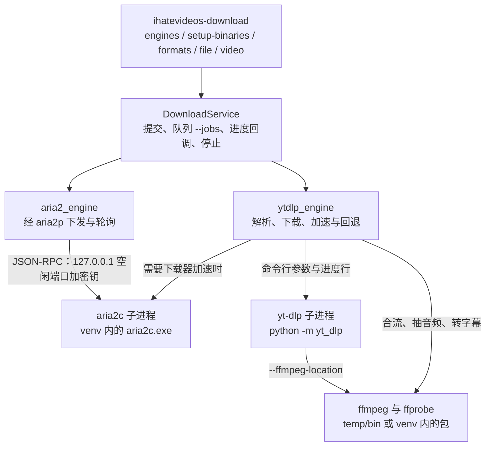
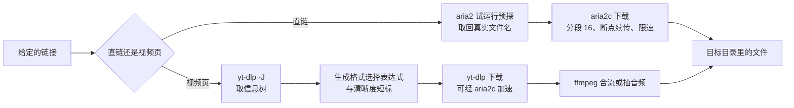
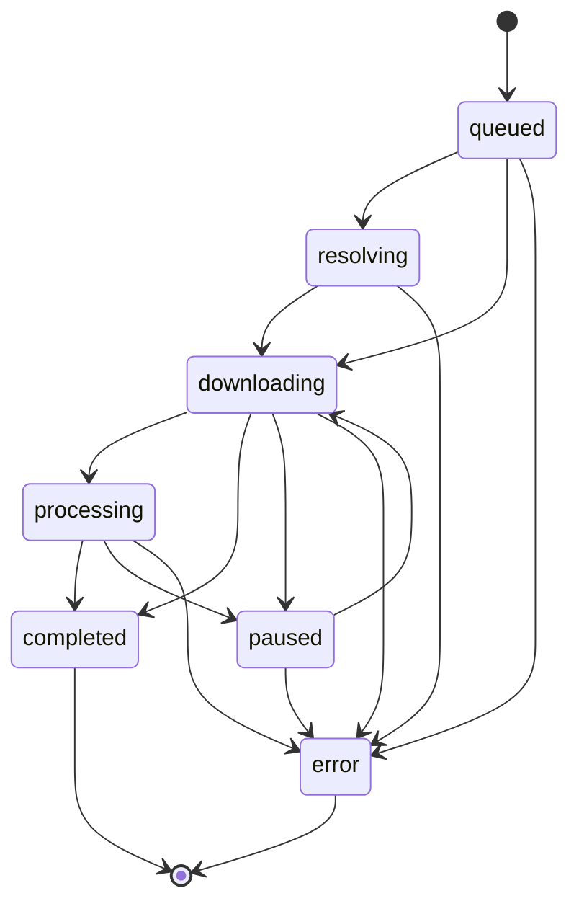

# 下载模块与 `ihatevideos-download` 命令实施计划（视频与直链）

目标工程：`F:\Codes\iHateVideos\iHateVideos`（Python 0.3.0，uv 管理）。
依据材料：`F:\Codes\iHateVideos\DownLord`（Electron + TypeScript 桌面下载器，版本 1.0.0）的 `src/main/`；`docs/external/downlord.md`（同一工程的完整调研与六单元总计划）。
本次范围：yt-dlp 视频路径与 aria2 直链路径，对应 downlord.md 的交付单元 1、2、4。

写这份计划的过程中在本机实测过的环境：

| 项目 | 实测结果 |
|---|---|
| uv | 0.11.8（0e961dd9e 2026-04-27） |
| Python | 3.11.4（Anaconda，`uv run --no-sync python`） |
| aria2c | 1.37.0，来自 PyPI 的 `aria2` 包，装在 venv 内 |
| ffmpeg | 7.1（`essentials_build`），来自 PyPI 的 `imageio-ffmpeg` 包，装在 venv 内；该包不带 ffprobe |
| yt-dlp | 2026.8.19，来自 PyPI 的 `yt-dlp` 包 |
| 安装实测 | `uv add aria2 aria2p yt-dlp imageio-ffmpeg` 在 Python 3.11 的 venv 里装齐，无冲突 |

计划里凡是标「实测」的结论，都在本机跑过并留下了输出，见第十节。

## 整体构成

新增一条命令 `ihatevideos-download`，把网络上的视频或直链文件取到本地。命令、服务与两个引擎的关系，以及各自驱动的外部进程：



一次运行里发生的事情：



两条路径共用一个任务队列与一套进度模型，`--jobs` 决定同时进行几个任务。没有历史库，任务只在这一次进程内存在，跑完就退出。

## 一、范围

### 纳入

- aria2 引擎：aria2c 子进程的启动与就绪等待、空闲端口与 RPC 密钥、任务级与全局选项下发、进度轮询与去重、终态判定、崩溃检测与退避重启、停止与清理。
- 直链下载：多线程分段、断点续传、文件名预探、限速。
- 视频路径：信息树解析、格式与字幕清单、清晰度标签、格式选择表达式、下载与合流、音频抽取、字幕下载、进度行解析、后处理阶段、最终路径捕获、进程树终止。
- 让 yt-dlp 经 aria2c 下载的加速路径，以及加速失败的三层回退。
- 系统代理跟随：读系统代理并下发给 aria2c 与 yt-dlp，`--no-proxy` 显式直连。本机需要代理才能访问部分站点，这一档是可用性的前提。
- 命令行 `ihatevideos-download`，以及 Skill 文档、Agent 命令白名单、`README`、`CHANGELOG`、`VERSION` 的同步。

### 排除

- BT 与磁力、tracker 表、种子文件选择与做种（downlord.md 单元 5）。
- SQLite 历史库、DAO、任务恢复计划、类别目录路由、查重与改名序号（downlord.md 单元 3）。
- yt-dlp 热更新（downlord.md 单元 6）。代理只做「跟随系统」一档，不做手动地址档与设置界面。
- 界面、浏览器扩展、下载接管、网页嗅探、扩展取 Cookie。

### 范围带来的后果：命令式形态与暂停语义

不建历史库，任务身份就只在一次进程内有效，`list`、`pause <id>`、`resume <id>` 这类跨进程命令找不到可以引用的对象。命令形态因此定为一次运行跑完就退出：

- 一次运行按 `--jobs` 并行处理给定的若干条链接，全部结束后输出汇总 JSON 并退出。
- 暂停表现为收到 Ctrl+C 后的有序停止：直链任务调用 `force_pause`（`.aria2` 控制文件留在目标目录），视频任务终止进程树（`.part` 留在目标目录）。再跑同一条命令即从断点继续，续传由 aria2 的 `--continue=true` 与 yt-dlp 自带的 `.part` 承担，这一侧不需要本模块保存任何状态。
- 服务接口保留 `pause()` 与 `resume()`，供以后把服务嵌进长驻进程的调用方使用。

## 二、模块结构与来源对照

新模块位于 `src/ihatevideos/download/`，与 `input`、`export`、`media`、`summarize` 并列。

| Python 文件 | 职责 | DownLord 来源 |
|---|---|---|
| `__init__.py` | 导出 `DownloadService`、`DownloadRequest`、`Task`、`TaskKind`、`TaskStatus`、`resolve_engines` | — |
| `models.py` | 数据类与枚举：`TaskKind`、`TaskStatus`、`Task`、`Progress`、`FormatInfo`、`SubtitleTrack`、`VideoInfo` | `src/shared/ipc.ts` 的数据模型部分 |
| `binaries.py` | 定位 aria2c、ffmpeg、ffprobe、yt-dlp 并读出各自的版本：先查项目内的 `temp/bin/`，再查 venv 内的包 | `binaries/probeVersion.ts`、`selfCheck.ts` |
| `errors.py` | 错误类与可读中文文案、aria2 错误码表 | `errors/errorCatalog.ts`、`mapError.ts` |
| `aria2_args.py` | 启动参数、任务级选项、限速选项 | `engine/aria2Args.ts`、`aria2Headers.ts`、`aria2Limit.ts` |
| `aria2_process.py` | 子进程启动与就绪等待、崩溃检测与退避、有序停止 | `engine/aria2Process.ts`、`port.ts`、`secret.ts` |
| `aria2_engine.py` | RPC 调用（经 aria2p）、进度轮询与去重、终态判定、文件名预探 | `engine/downloadEngine.ts`、`rpcCodec.ts` |
| `ytdlp_args.py` | 解析与下载参数组装、格式选择表达式 | `video/ytdlpArgs.ts`、`ytdlpFormat.ts`、`ytdlpCookie.ts`、`ytdlpHeaders.ts` |
| `ytdlp_process.py` | 子进程封装、进程树终止、环境变量清理 | `video/ytdlpProcess.ts`、`ytdlpEnv.ts`、`src/main/childEnv.ts` |
| `ytdlp_progress.py` | 进度行、后处理标签、最终路径的解析 | `video/ytdlpProgress.ts` |
| `ytdlp_json.py` | 信息树解析、字幕清单、清晰度标签 | `video/ytdlpJson.ts`、`ytdlpSubtitle.ts`、`qualityLabel.ts` |
| `ytdlp_engine.py` | 视频解析与下载的执行流程、加速与三层回退 | `video/videoEngine.ts`、`ytdlpDownloader.ts`、`formatAccel.ts` |
| `filenames.py` | 文件名清洗、默认取名、扩展名预测 | `video/filename.ts`、`tasks/taskManager.ts` 的取名部分 |
| `service.py` | `DownloadService`：提交、并行执行、进度回调、停止、关闭 | `engine/compositeEngine.ts`、`tasks/taskManager.ts` 的执行部分 |
| `cli.py` | `ihatevideos-download` 命令行 | 新增 |
| `install_binaries.py` | `setup-binaries` 的实际动作：下载构建包、只解出 ffmpeg 与 ffprobe、写 `SOURCES.json` | 新增 |

与现有模块的关系：本模块的 ffmpeg 来自 venv 内的 `imageio-ffmpeg`，ffprobe 来自项目内的 `temp/bin/`，都不经过 `media/ffmpeg.py` 的 `FFMPEG_PATH` 与 PATH 查找。`media` 模块保持原样，本次不改动它。

## 三、依赖与二进制：uv 装齐，取不到的放进项目内的目录

### 依赖

```
uv add aria2 aria2p yt-dlp imageio-ffmpeg
```

| 依赖 | 提供什么 | 实测 |
|---|---|---|
| `aria2` | aria2c 可执行文件本体。PyPI 上的静态构建 wheel（项目名 aria2-wheel），覆盖 win_amd64、win32、manylinux、musllinux 六种平台标签，没有 macOS，许可证 GPL-2.0 | venv 的 `Scripts` 里出现 `aria2c` 命令，`aria2c --version` 报 1.37.0；`aria2c.ARIA2C` 指向 venv 内 `Lib\site-packages\aria2c\bin\aria2c.exe` |
| `imageio-ffmpeg` | ffmpeg 可执行文件本体 | 0.6.0，`get_ffmpeg_exe()` 指向 venv 内 `site-packages\imageio_ffmpeg\binaries\ffmpeg-win-x86_64-v7.1.exe`（87.6 MB），`get_ffmpeg_version()` 报 `7.1-essentials_build`；该目录里没有 ffprobe |
| `yt-dlp` | 视频解析与下载 | 2026.8.19，`python -m yt_dlp --version` 可用 |
| `aria2p` | aria2c 的 JSON-RPC 与 WebSocket 客户端：下发任务、读进度、暂停、移除 | 0.12.1，带出 `requests`、`websocket-client`、`loguru`、`platformdirs` |

这些可执行文件全部装在 `.venv` 内。装完之后 `ihatevideos-download` 直接可用，不需要任何环境变量，也不往 PATH、注册表、系统目录或用户配置目录写任何东西。删掉 `.venv` 或整个项目即彻底清除。

### uv 取不到的那一个：ffprobe

`imageio-ffmpeg` 的目录里只有 ffmpeg。yt-dlp 从 `--ffmpeg-location` 指向的同一个目录里找 ffprobe，找不到时部分后处理会退到用 `ffmpeg -i` 探测。实测抽音频这条路径只靠 ffmpeg 就能完成（见第十节），但为了让 `--ffmpeg-location` 指向一个 ffmpeg 与 ffprobe 齐全的目录，与 DownLord 内置 `resources/bin` 的做法一致，加一条准备步骤：

```
uv run ihatevideos-download setup-binaries
```

它做的事：

| 步骤 | 内容 |
|---|---|
| 来源 | `https://github.com/GyanD/codexffmpeg/releases/download/9.0.2/ffmpeg-9.0.2-essentials_build.zip`，gyan.dev 的官方 GitHub 镜像；gyan.dev 自己的直链会中途断流 |
| 下载 | 用工程已有的 `httpx` 流式下载；中途断流时按 `Range` 续传重试，最多 8 次，每次必须拿到完整字节数才算成功 |
| 取出 | 从 zip 里只解出 `ffmpeg.exe` 与 `ffprobe.exe` 两个文件到 `<项目>/temp/bin/`，其余一律不写 |
| 记录 | 把来源 URL、HTTP `ETag`、字节数、下载后算出的 SHA256 写入 `<项目>/temp/bin/SOURCES.json` |
| 重复运行 | 已有文件且哈希与记录一致时直接跳过，`--force` 才重新下载 |
| 失败处理 | 下载中断、zip 结构不符、哈希不匹配都在原位置抛出错误，不留下半个文件 |

写入位置只有 `<项目>/temp/bin/`。这条命令不改 PATH、不改注册表、不写系统目录、不写用户配置目录、不往 `.venv` 外面放任何文件。`temp/` 已在 `.gitignore` 里，删掉 `temp/bin/` 或整个项目即彻底清除。

### 引擎位置

`binaries.py` 的查找顺序：

| 引擎 | 第一处 | 第二处 |
|---|---|---|
| aria2c | `<项目>/temp/bin/aria2c.exe` | `import aria2c` 之后读 `aria2c.ARIA2C` |
| ffmpeg | `<项目>/temp/bin/ffmpeg.exe` | `imageio_ffmpeg.get_ffmpeg_exe()` |
| ffprobe | `<项目>/temp/bin/ffprobe.exe` | 没有；缺失时不向 yt-dlp 传 ffprobe 所在目录 |
| yt-dlp | — | `sys.executable -m yt_dlp` |

传给 yt-dlp 的 `--ffmpeg-location` 指向 `<项目>/temp/bin/`（存在时 ffmpeg 与 ffprobe 都在里面），否则指向 `imageio_ffmpeg.get_ffmpeg_exe()` 返回的文件。`engines` 子命令输出的就是这套查找结果。

DownLord 的做法是三个引擎全部随应用打包、在应用内置目录里查找。本工程把能由 PyPI 提供的交给虚拟环境，把 ffprobe 这一个交给项目内的 `temp/bin/`。

## 四、技术决定

| 能力 | DownLord 的做法 | 本次的做法 | 依据 |
|---|---|---|---|
| aria2 控制 | 自写 JSON-RPC 客户端加 fetch | `aria2p` 的 `Client` 与 `API` | `Client(host, port, secret, timeout)` 构造，`API(client)` 包装；`Client` 上已有 `add_uri`、`tell_status`、`tell_active`、`change_option`、`change_global_option`、`force_pause`、`unpause`、`force_remove`、`remove_download_result`、`get_global_option`、`get_version`、`shutdown`。库内没有内置的轮询方法，轮询由本模块自己按固定间隔调用。库抛出的异常只有 `ClientException`（带 `code` 与 `message`），请求层的网络错误由 `requests` 原样抛出 |
| aria2c 的启动 | 应用内置目录定位后 spawn | 本模块用 `subprocess.Popen` 启动，参数见第六节 | aria2p 不启动任何进程，启动与停止由本模块负责 |
| 进度比例 | 读 RPC 返回的字段 | 用 `completed_length / total_length` 自行计算 | 实测这两个属性可直接读取，不依赖库计算的 `progress` |
| 视频调用 yt-dlp | `yt-dlp.exe` 子进程，`-J` 取信息树，`--progress-template` 取进度 | `python -m yt_dlp` 子进程，参数与行解析规则照搬 | 实测本机 `python -m yt_dlp` 可用；子进程形态便于按进程树终止，线程内调用 `YoutubeDL` 无法安全终止 |
| 子进程终止 | `child_process.spawn` 加 `taskkill /T /F` | `subprocess.Popen` 加 `taskkill /pid <pid> /T /F`（Windows）、`os.killpg`（POSIX） | 与 DownLord 的策略相同：先终止进程树，再终止父进程 |
| 并发 | Node 事件循环加 `setInterval` 轮询 | `threading`：aria2 轮询线程一个，视频任务按 `--jobs` 起工作线程，每个工作线程管一个 yt-dlp 子进程 | 轮询与状态改动都要有单一执行者 |
| 命令行输出编码 | — | `main()` 里 `sys.stdout.reconfigure(encoding="utf-8")` 与 stderr 同样处理 | `docs/audit/risks.md` 的 R1：Agent 的 `run_cli` 按 UTF-8 解码子进程输出，`input`、`export`、`summarize`、`agent` 四个命令缺这一步，中文乱码。新命令从一开始就带上 |

调用方式统一为 `sys.executable -m yt_dlp`，不使用 `yt-dlp.exe`：子进程形态便于按进程树终止，venv 内的模块与解释器也天然配套。

## 五、命令行设计

```
ihatevideos-download engines
ihatevideos-download setup-binaries [--force]
ihatevideos-download formats <url> [--cookie FILE] [--cookie-from-browser BROWSER] [--no-proxy]
ihatevideos-download file <url> [<url> ...] [--out-dir DIR] [--filename NAME]
                                 [--limit KBPS] [--global-limit KBPS] [--jobs N]
ihatevideos-download video <url> [<url> ...] [--format ID] [--height N] [--audio-only]
                                 [--subs LANGS] [--sub-format FMT] [--write-auto-subs]
                                 [--out-dir DIR] [--filename NAME]
                                 [--limit KBPS] [--global-limit KBPS] [--jobs N]
                                 [--no-accel] [--cookie FILE] [--cookie-from-browser BROWSER] [--no-proxy]
```

各子命令的输出（标准输出一行 JSON，`ensure_ascii=False`）：

| 子命令 | 输出字段 |
|---|---|
| `engines` | `command`、`aria2c{path,version,source}`、`ffmpeg{path,version,source}`、`ffprobe{path,version,source}`、`yt_dlp{path,version,kind}`、`ready` |
| `setup-binaries` | `command`、`bin_dir`、`downloaded`、`skipped`、`files[]{name,bytes,sha256}` |
| `formats` | `command`、`url`、`id`、`title`、`duration_seconds`、`uploader`、`extractor`、`formats[]{format_id,ext,height,fps,vcodec,acodec,filesize,tbr,note,protocol,quality_tag}`、`subtitles[]{lang,name,auto,formats}` |
| `file` | `command`、`tasks[]{id,url,status,filename,save_path,size_bytes,error}` |
| `video` | `command`、`tasks[]{id,url,status,title,format_id,quality_tag,filename,save_path,size_bytes,subtitles[],error}` |

进度走标准错误，一行一条，形如：

```
[1/2 video] 45.3%  2.14 MiB/s  12.3 MiB / 27.1 MiB  01:05 剩余
[1/2 video] 后处理中（Merger）
[1/2 video] 完成 -> F:\Videos\标题 [1080p].mp4
```

退出码沿用工程现有约定：`0` 成功，`2` 输入不合法（缺参数、路径不存在、格式编号不在清单里），`1` 运行失败（引擎启动失败、下载失败、被 Ctrl+C 中断），`3` 正常跳过（站点不被 yt-dlp 支持、没有可用格式、字幕语言不存在）。

`--height` 与 `--format` 互斥。`--height` 给出清晰度上限，表达式按第六节生成。都不给时按最高清晰度自动选择，与 DownLord 的自动选择一致。

## 六、引擎参数

这一节是移植的核心内容，数值与字符串都照 DownLord 的源码抄录，出处逐项标注。

### aria2c 启动参数

`engine/aria2Args.ts:98-172` 的非 BT 部分：

```
--enable-rpc
--rpc-listen-port=<空闲端口>
--rpc-listen-all=false
--rpc-secret=<32 字节随机值的十六进制>
--continue=true
--max-connection-per-server=16
--split=16
--min-split-size=1M
--file-allocation=none
--connect-timeout=10
--dir=<默认下载目录>
--stop-with-process=<本进程 pid>
--auto-save-interval=1
--max-concurrent-downloads=10
```

条件项：`--max-download-limit=<N>K` 只在 `N>0` 时加入，`N<=0` 时下发 `0` 表示不限速。

这一整组参数已在本机实测通过（见第十节），aria2c 1.37.0 正常启动并响应 RPC。

### 空闲端口与 RPC 密钥

DownLord 用 `net.createServer().listen(0)` 取操作系统分配的端口再关闭（`engine/port.ts`），密钥用 `crypto.randomBytes(32).toString('hex')`（`engine/secret.ts`）。Python 侧用 `socket.bind(("127.0.0.1", 0))` 取端口，用 `secrets.token_hex(32)` 生成密钥。两者实测都可用。

### 子进程与就绪等待

- 启动方式：`subprocess.Popen`，标准输出与标准错误接管，日志按环状缓冲保留最后 100 行，出错时附在错误信息里。Windows 上加 `CREATE_NO_WINDOW`。子进程环境里删除 `http_proxy`、`https_proxy`、`all_proxy`、`ftp_proxy`、`no_proxy`（大小写不敏感）。
- 就绪判定：每 200 毫秒调用一次 `get_version`，总超时 5000 毫秒；失败则换端口重启，最多 3 次（`engine/aria2Process.ts`）。
- 崩溃检测：子进程退出且不是本模块主动停止时算一次崩溃，60 秒内超过 5 次即判定为崩溃风暴，停止重启并抛错。退避间隔为 `500ms × 2^(崩溃次数-1)`，崩溃次数上限参与指数计算的取值是 10（`engine/aria2Process.ts`）。
- 停止：调用 `shutdown`，等待退出，超时用 `force_shutdown`，最后 `kill()`。`--stop-with-process` 是第二道保险。

### 任务级选项与进度

- 直链任务下发的选项：`dir`、`out`（用户给了文件名时）、`max-download-limit`（`>0` 时为 `'<N>K'`，否则 `'0'`）。请求头按 `engine/aria2Headers.ts:22-27` 的映射下发（`Referer` 对应 `referer`，`User-Agent` 对应 `user-agent`）。
- 进度轮询：间隔 1000 毫秒，调用 `tell_active`，读取的字段为 `gid`、`status`、`totalLength`、`completedLength`、`downloadSpeed`、`connections`、`errorCode`、`errorMessage`、`files`（`engine/downloadEngine.ts` 的 `PROGRESS_KEYS`）。
- 去重：`status`、`downloadedBytes`、`speed`、`savePath` 四个字段都没有变化时不重复上报。
- 终态判定：上一轮还在活动列表里的 `gid` 消失后，调用 `tell_status` 确认。`complete` 映射为完成，`error` 与 `removed` 映射为失败，读取 `errorCode` 与 `errorMessage`。错误码 1 到 32 的中文文案照 `errors/mapError.ts:136-157` 的表。
- 一个实测细节：刚调用 `add_uri` 之后立刻读取 `total_length` 得到 0，下一轮才填上真实值。进度上报要跳过 `total == 0` 的帧，否则会输出一次 0% 的假进度。
- 暂停、继续、删除分别调用 `force_pause`、`unpause`、`force_remove`，删除后再调用 `remove_download_result` 清掉结果记录。

### 文件名预探

直链任务在提交前用一次试运行取回真实文件名（`engine/downloadEngine.ts` 的 `resolveHttpFilename`）：建立一个带 `dry-run:true`、`continue:false`、`auto-file-renaming:true`、`allow-overwrite:false`、`connect-timeout:3`、`timeout:5`、`max-tries:1`、`retry-wait:0` 的任务，按不超过 100 毫秒的间隔轮询 `tell_status` 的 `status` 与 `files` 字段，状态到 `complete` 时取 `files[0].path`，总超时 5000 毫秒。无论成功失败，都在 `finally` 里 `force_remove` 加 `remove_download_result`。失败返回空值，由 URL 末段取名兜底。

### yt-dlp 解析参数

`video/ytdlpArgs.ts:39-64`：

```
-J --flat-playlist --no-warnings --ignore-config --no-color --socket-timeout 30 <url>
```

超时不在命令行里，DownLord 用 90 秒的 `AbortController` 终止（`tasks/taskManager.ts`）。Python 侧用 `subprocess` 的等待超时加进程树终止实现同样效果，实测本机 `-J` 解析 B 站链接成功。

### yt-dlp 下载参数

`video/ytdlpArgs.ts:121-190` 与 `video/ytdlpDownloader.ts`：

```
-f <格式选择表达式>
-o <目录>/<文件名基>.%(ext)s
--no-playlist --newline --progress
--progress-template dlp:%(progress.status)s|%(progress.downloaded_bytes)s|%(progress.total_bytes)s|%(progress.total_bytes_estimate)s|%(progress.speed)s
--ffmpeg-location <ffmpeg 路径>
--windows-filenames --no-color --no-warnings --ignore-config --no-quiet --socket-timeout 30
--print after_move:%(filepath)j
<url>
```

按条件追加：

| 条件 | 追加的参数 |
|---|---|
| 只要音频 | `-x --audio-format mp3 --audio-quality 0` |
| 选了需要合流的格式 | `--merge-output-format mp4` |
| 有字幕选择 | `--write-subs`，含自动字幕时再加 `--write-auto-subs`，以及 `--sub-langs <语言>`、`--sub-format <格式>/best`、`--convert-subs <格式>`；有字幕参数时再补一个 `-i` |
| 不加速 | `--concurrent-fragments 4` |
| 加速 | `--downloader <aria2c 绝对路径>`，以及 `--downloader-args aria2c:-x 16 -s 16 -k 1M --connect-timeout=10 --auto-save-interval=1 --allow-overwrite=true --all-proxy=<代理>`。限速与代理都要写在这里，因为 yt-dlp 的 `--limit-rate` 对外部下载器不生效，而 aria2c 不读系统代理 |
| 限速且不加速 | `--limit-rate <N>K` |
| 限速且加速 | `--downloader-args` 里追加 ` --max-download-limit=<N>K` |
| Cookie | `--cookies <文件>` 或 `--cookies-from-browser <浏览器>` |
| 实际格式与拿不到的格式 | `--no-quiet` 必须带上：`--print` 会隐含静默模式，加上它才会保留 `[info] ... Downloading 1 format(s): 100026+30280` 这类行，任务记录里的 `format_id` 才能反映实际选中的格式；也只有这样才拿得到「4K 与 1080P 高码率需要大会员」这类提示，任务完成时原样打印到标准错误 |

`--downloader` 取 `aria2c.ARIA2C` 的绝对路径，yt-dlp 因此不需要在 PATH 里查找 aria2c。这一项与 `--downloader-args` 成对出现，只给 `--downloader-args` 不会选中 aria2c。两者都排在 `--print` 之前，避免干扰最终路径的捕获（`video/ytdlpArgs.ts:157`、`ytdlpArgs.test.ts:258-274`）。
`--concurrent-fragments` 的取值常量是 4（`video/formatAccel.ts:20`）。DownLord 全仓库没有 `--no-part` 与 `--continue`，续传靠 yt-dlp 默认保留 `.part`。

### 格式选择表达式

`video/ytdlpFormat.ts:21-48`，五个分支按顺序判定：

| 输入 | 表达式 | 合流格式 |
|---|---|---|
| 只要音频 | `bestaudio/best` | — |
| 指定编号，且该格式音频编码为 `none` | `<编号>+bestaudio/<编号>` | `mp4` |
| 指定编号，且该格式自带音频 | `<编号>` | — |
| 给了清晰度上限 | `bestvideo[height<=<上限>]+bestaudio/best[height<=<上限>]/best` | `mp4` |
| 兜底 | `best` | — |

### 进度行解析

`video/ytdlpProgress.ts:58-93`：

- 以 `dlp:` 开头的行按 `|` 切成五段。只接受状态为 `downloading` 或 `finished` 的帧，其余返回空。
- `finished` 帧：已下载字节取已下载值或总量，总量取总量或估算值或 0，速度为 0，标记本轮结束。
- `downloading` 帧：总量取总量或估算值或 0。
- 实测发现：模板里取不到的字段输出字面量 `NA`。JavaScript 里 `Number("NA")` 得到 `NaN`，进入假值分支被跳过；Python 必须显式把 `NA` 映射为空值，否则会抛出异常。
- 后处理行由标签正则识别：`^\[(Merger|ExtractAudio|VideoConvertor|Fixup\w*|Metadata)\]`，以及含 `Deleting original file` 的行（`video/ytdlpProgress.ts:29-31`）。命中即把阶段置为 `processing`，且每次下载只上报一次阶段变化。
- 最终路径：`--print after_move:%(filepath)j` 输出一行带引号的 JSON 字符串。解析规则为：以 `"` 开头结尾则按 JSON 解析，结果是字符串且匹配绝对路径正则（`^([A-Za-z]:[\\/]|\\\\|/)`）即认定为最终路径；否则对裸的绝对路径行同样认定。`%(filepath)j` 是带转义的 JSON，中文路径不会被子进程的输出编码破坏，这正是 DownLord 选用它的原因。另外 `^\[download\]\s+(.+?)\s+has already been downloaded$` 命中的行也算最终路径（`video/ytdlpProgress.ts:33,49,114-135`）。实测本机输出确为 `"...\\sample.mp4"` 形式的转义 JSON 行。

### 加速与三层回退

`video/formatAccel.ts`：

- 分片协议清单：`m3u8`、`m3u8_native`、`http_dash_segments`、`dash`。命中清单的格式不交给 aria2c，因为 aria2c 不理解 m3u8 与 dash 清单，注定失败并触发一次没有意义的回退与进程重启。
- 三层回退（`docs/ARCHITECTURE.md:192` 的原始描述）：第一层是提交前的预探测，二进制缺失就不加速；第二层是运行期间发现非主动终止的非零退出时，记下已经尝试过加速，改用 yt-dlp 自带下载器重启一次，这期间任务保持 `downloading` 状态不报错，限速改用 `--limit-rate`；第三层是自带下载器仍然失败才真正置为失败。
- 在加速与自带下载器之间切换时清掉目标目录里以文件名基开头的 `.part`、`.aria2`、`.ytdl`、`.part-Frag*` 残留；同一个下载器继续时不清理，以便续传（`video/videoEngine.ts:177-203,335-343`）。

### 文件名

`video/filename.ts` 与 `tasks/taskManager.ts:1065-1068`、`1338-1340`：

- 清洗：非法字符 `< > : " / \ | ? *` 与控制字符 0x00 到 0x1f 全部替换成 `_`；去掉尾部连续的点与空格；最后一段扩展名之前的名称命中 Windows 保留设备名（`CON`、`PRN`、`AUX`、`NUL`、`COM1` 到 `COM9`、`LPT1` 到 `LPT9`，不区分大小写）时加前缀 `_`；清洗后为空则用 `download`。
- 默认取名：`<清洗后的标题> [<清晰度短标>].<扩展名>`，标题为空时用 `video-<编号>`；短标为空时不加中括号那一段。
- 清晰度短标（`video/qualityLabel.ts:31-36`）：只要音频时为空；指定了具体格式时取该格式的 `height`，写成 `<height>p`；给了清晰度上限且上限不小于 2160 时为 `最高`，否则为 `<上限>p`；都没有时为 `最高`。
- 扩展名预测（`video/filename.ts:50-58`）：只要音频时为 `mp3`；没有选定格式或该格式音频编码为 `none` 时为 `mp4`；否则用该格式自带的扩展名。

## 七、数据模型与状态

```python
class TaskKind(StrEnum):
    DIRECT = "direct"
    VIDEO = "video"

class TaskStatus(StrEnum):
    RESOLVING = "resolving"
    QUEUED = "queued"
    DOWNLOADING = "downloading"
    PROCESSING = "processing"
    PAUSED = "paused"
    COMPLETED = "completed"
    ERROR = "error"
```

七个状态，比 DownLord 的八态少一个 `awaiting_selection`：命令形态下「解析完成但还没选清晰度」由 `formats` 子命令表达，不由状态表达。视频任务由工作线程接手时先进入 `resolving`（取信息树），再进入 `downloading`。

合法流转（照 `tasks/stateMachine.ts` 修剪）：



非法流转抛出错误并保留任务当前状态。

`Task` 的字段：`id`、`kind`、`source`、`status`、`title`、`filename`、`save_path`、`out_dir`、`selector`（格式选择的摘要）、`quality_tag`、`total_bytes`、`downloaded_bytes`、`speed`、`subtitles`、`error`、`started_at`、`completed_at`。只在内存里保存的运行时字段：`gid`、`accel_used`、`accel_fallback_tried`、`fragmented`。

`Progress` 的字段：`task_id`、`status`、`phase`（`download` 或 `processing`）、`downloaded_bytes`、`total_bytes`、`speed`、`eta_seconds`。

## 八、与现有工程的连接

1. `agent/tools.py:7-14` 的 `ALLOWED_COMMANDS` 增加一条 `"ihatevideos-download": {"engines", "formats", "file", "video"}`；同文件 `run_cli` 的 docstring 命令列表、`harness.py:11-12` 的 SYSTEM_PROMPT 的散文一并更新。
2. `pyproject.toml:18-24` 的 `[project.scripts]` 增加 `ihatevideos-download = "ihatevideos.download.cli:main"`。
3. 新增 `skills/ihatevideos-download/SKILL.md`，frontmatter 写 `name` 与 `description` 两项，正文按现有 Skill 的章节组织：何时使用、模块位置、命令、产物位置、Agent 判断、回给上层、依赖、测试提示词。
4. `README.md:7-14` 的目录组成、`README.md:18-23` 的快速开始、`CHANGELOG.md` 新增一条记录、`VERSION` 与 `pyproject.toml` 的版本号同步。
5. `docs/README.md` 登记本文档（新增 `plan/` 一栏）。

## 九、交付单元与验收

六个交付单元按依赖顺序排列，每个单元都能独立运行并当场看到结果。命令都在工程根目录执行。

### 单元 1 依赖、二进制准备与 `engines`

内容：`pyproject.toml` 的依赖与脚本入口、`binaries.py`、`install_binaries.py`、`errors.py`、`models.py`、`cli.py` 的 `engines` 与 `setup-binaries` 两个子命令。
来源：`binaries/probeVersion.ts`、`selfCheck.ts`、`errors/errorCatalog.ts`、`errors/mapError.ts`。

验收：

```
uv run ihatevideos-download engines
```

期望 `engines` 输出三个引擎的路径与版本：aria2c 1.37.0 且路径在 `.venv` 内的 `site-packages\aria2c\bin\`，ffmpeg 7.1 与 yt-dlp 2026.8.19 都由 venv 内的包给出，`ready` 为真。随后运行 `uv run ihatevideos-download setup-binaries`：`temp/bin/` 里出现 `ffmpeg.exe` 与 `ffprobe.exe`，`SOURCES.json` 记下来源 URL 与 SHA256，再运行一次应跳过下载；此时 `engines` 的路径应改为指向 `temp/bin/`。

### 单元 2 aria2 引擎与直链下载

内容：`aria2_args.py`、`aria2_process.py`、`aria2_engine.py`、`filenames.py`、`service.py` 的直链部分、`cli.py` 的 `file` 子命令。
来源：`engine/aria2Args.ts`、`aria2Process.ts`、`port.ts`、`secret.ts`、`downloadEngine.ts`、`rpcCodec.ts`、`video/filename.ts`。

验收：

```
uv run ihatevideos-download file "https://download.blender.org/peach/bigbuckbunny_movies/BigBuckBunny_320x180.mp4.zip" --out-dir temp/download
uv run ihatevideos-download file "https://download.blender.org/peach/bigbuckbunny_movies/BigBuckBunny_320x180.mp4.zip" --out-dir temp/download --limit 512
```

期望：第一条产出 64657225 字节的文件，输出 JSON 里的 `size_bytes` 与磁盘一致；第二条运行期间用 `--limit 512` 时标准错误里的速度稳定在 512 KiB/s 附近。中途按 Ctrl+C 后输出 JSON 里的状态应是 `paused`，目录里留下 `<文件名>.aria2` 控制文件；再跑同一条命令应从中断的百分比继续而不是从 0 开始。运行结束后系统里没有残留的 aria2c 进程。

### 单元 3 视频解析

内容：`ytdlp_args.py` 的解析部分、`ytdlp_process.py`、`ytdlp_json.py`、`cli.py` 的 `formats` 子命令。
来源：`video/ytdlpArgs.ts:39-64`、`ytdlpJson.ts`、`ytdlpSubtitle.ts`、`qualityLabel.ts`。

验收：

```
uv run ihatevideos-download formats "https://www.bilibili.com/video/BV1Kxeb6mE8o"
```

期望输出标题、时长、up 主、格式清单（含每条的分辨率、编码、文件大小、协议）与字幕语言清单。给一个 yt-dlp 不支持的地址，命令以退出码 3 结束。

### 单元 4 视频下载

内容：`ytdlp_args.py` 的下载部分、`ytdlp_progress.py`、`ytdlp_engine.py`、`service.py` 的视频部分、`cli.py` 的 `video` 子命令。
来源：`video/ytdlpArgs.ts:121-190`、`ytdlpProgress.ts`、`videoEngine.ts`、`ytdlpDownloader.ts`、`ytdlpEnv.ts`。

验收：

```
uv run ihatevideos-download video "https://www.bilibili.com/video/BV1Kxeb6mE8o" --height 720 --out-dir temp/download
uv run ihatevideos-download video "https://www.bilibili.com/video/BV1Kxeb6mE8o" --audio-only --out-dir temp/download
```

期望：第一条产出 `<标题> [720p].mp4`，标准错误里进度按秒刷新，进入合流阶段时打印后处理中，完成后 `save_path` 与磁盘文件一致；第二条产出 `<标题>.mp3`。两条都要核对输出 JSON 里的文件大小与实际占用一致。

### 单元 5 加速与三层回退

内容：`ytdlp_engine.py` 的加速分支与回退、`ytdlp_args.py` 的下载器参数、`filenames.py` 的残留清理。
来源：`video/formatAccel.ts`、`ytdlpDownloader.ts`、`videoEngine.ts:177-203,329-343,462-467`。

验收：对同一个视频用加速与 `--no-accel` 各跑一次，比较两次的下载参数与产物，加速那次的参数里应含 `--downloader <venv 内 aria2c 绝对路径>`；对一条 HLS 或 DASH 地址跑一次，确认参数里没有 `--downloader`。加速进行到一半时手工结束 aria2c 进程，应看到退回自带下载器重跑一次并正常完成，任务状态不经过失败。在一个临时的 venv 里把 `site-packages\aria2c\bin\aria2c.exe` 改名成 `.bak` 之后：`engines` 应报 aria2c 不可用，`file` 子命令应以退出码 1 报缺少 aria2c，`video` 子命令应照常完成且不采用加速；测完把名字改回。

### 单元 6 工程接入

内容：Skill 文档、Agent 白名单、`README`、`CHANGELOG`、`VERSION`、`docs/README.md`。
来源：现有 `skills/*/SKILL.md` 的结构、`agent/tools.py`、`README.md`。

验收：`uv run ihatevideos-agent` 的对话里让它下载一条视频，能看到它调用 `ihatevideos-download`；Skill 文档里列的每条命令都能按文档描述运行。

## 十、验证方式

### 纯函数单元测试

新建 `tests/` 目录，测试框架用 `pytest`（`pyproject.toml` 的 `[dependency-groups] dev`）。下面前五项在 DownLord 里都有对应测试文件，用例可以直接转写：

1. 格式选择表达式：五个分支的输入输出（照 `video/ytdlpFormat.ts:21-48`）。
2. 进度行解析：`downloading` 帧、`finished` 帧、`NA` 字段、非 `dlp:` 行、后处理标签行、最终路径行、已下载过提示行。
3. 清晰度标签与短标：四个分支（`video/qualityLabel.test.ts:59-82` 的用例可直接转写，含「仅音频为空」「指定格式取实际高度」「上限不小于 2160 为最高」「兜底为最高」）。
4. 文件名清洗与扩展名预测：非法字符、尾部点与空格、Windows 保留设备名、空标题、四种扩展名判定。
5. aria2 启动参数与任务级选项：参数列表相等断言（照 `engine/aria2Args.test.ts`）。
6. 状态流转表：合法与非法流转各若干组。

### 真机验收

按第九节的六个单元逐条执行，保留命令输出。素材都已实测可达：

| 用途 | 地址 | 实测 |
|---|---|---|
| 直链文件（分段、限速、中断续传） | `https://download.blender.org/peach/bigbuckbunny_movies/BigBuckBunny_320x180.mp4.zip` | 200，64657225 字节，实测 2.2 MiB/s 完整下完 |
| 视频站点 | 工程现有的 B 站链接 | `-J` 解析实测成功 |
| yt-dlp 只用 venv 内的 ffmpeg | 工程现有的 B 站链接 | 把 `imageio_ffmpeg.get_ffmpeg_exe()` 作为 `--ffmpeg-location`，`-f worstaudio -x --audio-format mp3` 成功产出 6930635 字节的 mp3，过程不需要 ffprobe |

不使用任何替代实现、模拟数据或只为通过测试的临时处理。

## 十一、前提与已知限制

- 本次只覆盖 DownLord 主进程里的下载业务。界面、浏览器扩展、下载接管、网页嗅探、扩展取 Cookie 在 Python 侧没有载体，不做。
- DownLord 里「与改动前逐字节等价」的约定靠 TypeScript 的快照测试与 `deepEqual` 断言维持，移植时转换成参数列表相等断言与固定输入输出用例，含义不变。
- B 站下载在本工程里由 yutto 负责，DownLord 用 yt-dlp，两者能力有重叠。本次不改动 `input` 的 B 站路径。
- 需要登录的站点走 yt-dlp 的 `--cookies-from-browser` 或导出的 cookies.txt。`input` 模块的 `cookies` 命令导入的 SESSDATA 是给 B 站字幕接口用的，两者不通用。
- 代理只做「跟随系统」一档：读系统代理后下发给 aria2c（`--all-proxy`）与 yt-dlp（`--proxy`），`--no-proxy` 显式直连。DownLord 的手动地址档与设置界面不做。
- 视频路径与直链路径共用同一个 `DownloadService`，两条路径的任务在一个 `--jobs` 队列里排队。
- 本模块只往两个地方写：目标下载目录，以及项目内的 `temp/`（运行数据与 `temp/bin/` 里的二进制）。不写 PATH、不写注册表、不写系统目录、不写用户配置目录、不装到项目之外。删掉项目即彻底清除。
- 依赖里 `aria2` 包内嵌的 aria2c 与 `imageio-ffmpeg` 包内嵌的 ffmpeg 都是 GPL 构建。本机自用不受影响，将来要对外分发时按各自的许可证处理。

## 十二、需要拍板的事项

1. 是否同时给 `ihatevideos-input` 的 `resolve` 增加一条通用视频路径：平台判定返回空且链接不是 B 站时交给本模块只取音频。这条改的是已经通过验证的链路，本次没有动。
2. `ihatevideos-download` 是否需要把 `formats` 的输出写成文件，供 `video --format` 的后续运行引用。命令形态下这一步不是必需，但批量任务时少一次解析。
